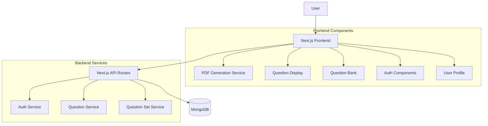
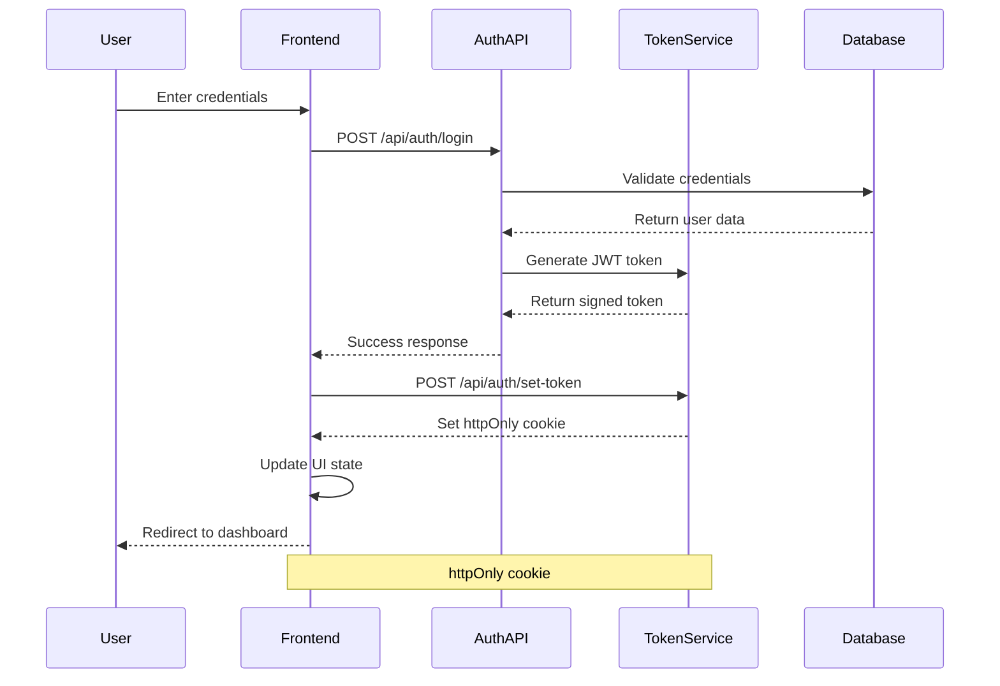
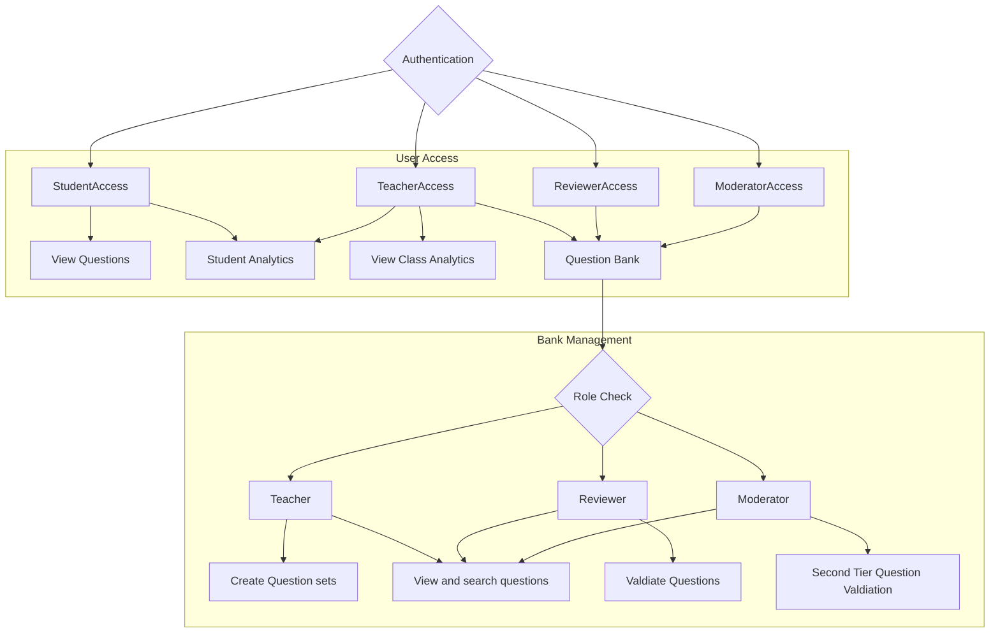
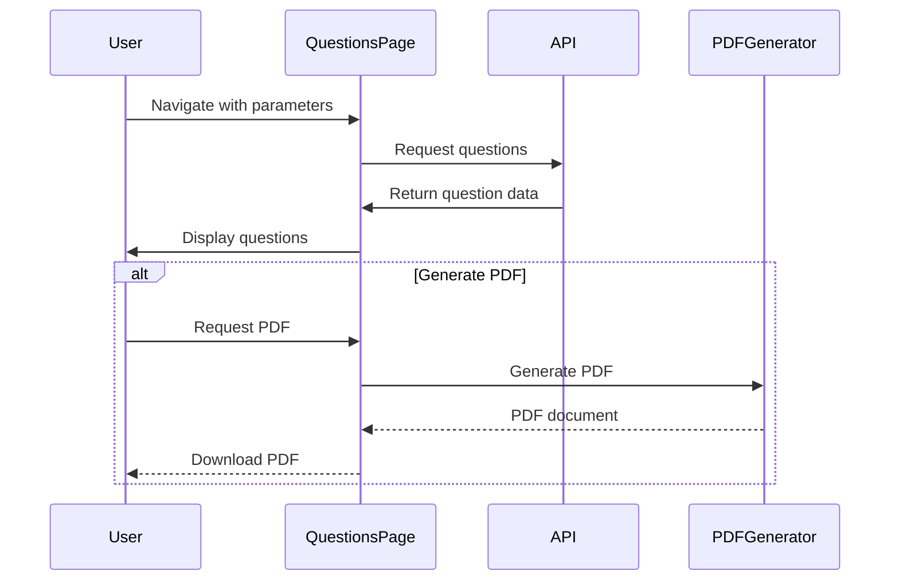
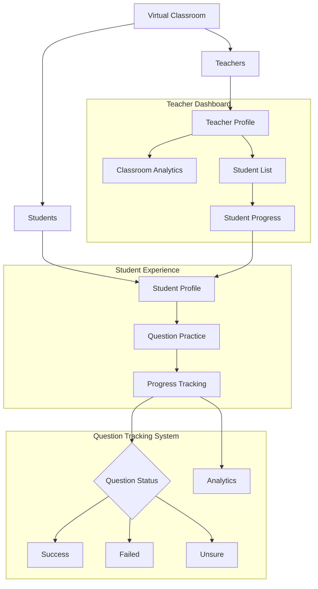

# Learning Platform Architecture Overview

## Technical Stack
- **Frontend**: Next.js, React, TypeScript
- **Styling**: CSS Modules
- **Backend**: Next.js API Routes
- **Database**: MongoDB (Should move to PostgreSQL)
- **Math Rendering**: react-markdown, remark-math, rehype-kayex
- **PDF Generation**: jsPDF, html2canvas, KaTeX
- **Authentication**: JWT-based authentication

## System Overview
The Learning Platform is a Next.js-based application designed to provide an interactive question practice environment for students and a comprehensive question management system for educators. The system employs a React frontend with server-side rendering capabilities through Next.js, communicating with MongoDB for data storage via API routes.

## Core Domains

### Authentication System
The authentication system manages user identity and access control across the platform, implementing JWT-based authentication with secure token handling and role-based permissions.

**User Types:**
- Students: Access to practice questions and track progress
- Teachers: Additional access to create question sets and view student performance
- Reviewers: Special access to review and approve questions
- Moderators: Administrative access to manage questions and users

**Authentication Flow:**

**Security Features:**
- HttpOnly cookies for token storage
- JWT tokens with appropriate expiration times
- Password hashing with bcrypt and appropriate salt rounds
- Secure password reset flow with time-limited tokens

**Key Auth Endpoints:**
- `POST /api/auth/login`: Authenticates users and generates JWT tokens
- `POST /api/auth/logout`: Invalidates current session
- `GET /api/auth/me`: Returns current authenticated user information
- `POST /api/auth/recover`: Initiates password recovery process
- `POST /api/auth/reset-password`: Completes password reset with validation token
- `POST /api/auth/set-token`: Sets authentication token as httpOnly cookie
- `POST /api/auth/signup`: Creates new user accounts with validation

**Session Management:**
- Session timeout after period of inactivity
- Activity tracking and management

**Access Control:**
The platform implements a role-based access control system where each user type has specific permissions:

**Authentication State Management:**
The application uses a context-based approach to manage authentication state in the frontend, making the current user information available throughout the component tree without prop drilling.

### Question Management
The question management system handles the creation, organization, and delivery of educational content through a hierarchical structure.

**Question Hierarchy:**
1. Question Bank: Central repository of all questions
2. Question Sets: Curated collections of questions for specific purposes
3. Practice Sessions: Interactive interfaces for students to engage with questions

**Question Set Types:**
- DPS Format: Structured format with specific question types and quantities
- Freeform: Flexible collections of questions without strict format requirements
- PDF Question Sets: Pre-generated PDF documents with questions and solutions

**Question Display Flow:**

## **Teacher - Student Interaction:**
Teachers and students can be added to virtual classrooms which allows the teacher to keep track of their students.

**Classroom Management Features:**
- **Virtual Classrooms**: Can be joined similar to a party system.
- **Student Progress Tracking**: Detailed view of each student's performance metrics
- **Classroom Analytics**: Overview of aggregate performance data across all students
- **Student Management**: View of all students with pagination for larger classrooms

**Student Progress Tracking:**
- Each student action is tracked with timestamps and status (success, failed, unsure)
- Student profiles display comprehensive metrics on question attempts
- Question history with pagination shows detailed progress over time
- Support for both standard questions and PDF question sets in tracking

**Teacher Overview:**
- Can bview the aggregated class data.
- Teachers have access to student data to keep track of individual progress.

**Data Flow:**
1. Students attempt questions and mark their understanding level
2. Question attempts are recorded in the user's `question_tracking` object
3. Teachers access aggregated data through classroom analytics
4. Individual student profiles show detailed progress metrics

**Implementation Components:**
- User model stores question tracking data with status and timestamps
- TeacherProfile component displays classroom and student analytics
- StudentProfile component shows personalized progress tracking
- Activity tracking system monitors student engagement

## Current Pain Points
- **PDF Generation Performance**: The PDF generation process is resource-intensive and can be slow for large question sets. Not to mention it is not yet reliable in all edge cases.
- **Component Structure**: Several large components have grown beyond their initial scope.
- **State Management**: Prop-drilling and context in some areas makes state management complex.
- **Role Management**: The current roles were created by the request of the client. Ideally we should move to a more flexible approach.
- **API Route Organization**: As the application has grown, API routes have become less organized and harder to maintain.
- **Error Handling**: Inconsistent error handling patterns across different API endpoints..
- **TypeScript Coverage**: Some components lack proper TypeScript typing.
- **Design**: There was no overarching design in mind, features were implemented as needed and sometimes refactored only when it was "in the way".
- **Test Coverage**: Limited automated testing.
- **Unused Code**: Code that was used in different iteration but not deleted.
- **Documentation**: Incomplete API documentation and architectural references.

## Unimplemented Features
- **Signup**: Currently the users would not be able to set their own roles.
- **On-demand question generation**: We only use the existing questions in the database.
- **Dynamic Question Set Generation**: On-demand question set generation based on different requierments. It should be balanced in difficulty and create unique questions sets for each session. It should also be adaptive to the student previous progress.
- **User Management**: Besides changing your own password nothing can be modified from the platform.
- **Classroom Management**: Right now we modify the database directly when needed.
- **Favorite/Bookmark Questions**: Questions/question sets can't be bookmarked.
- **Question Set Assignment/Explorer**: Right now we simply show on the main page all the sets to all the users.
- **Leaderboards**: Gamification of student experience
- **Reporting**: Allowing the users (not just reviewers/moderators) to mark the questions as incorrect or with rendering errors.