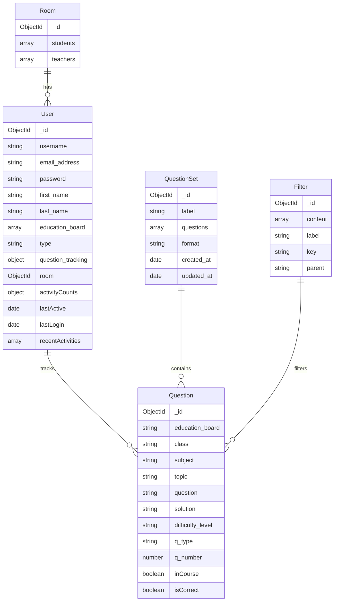

# Data Layer Documentation

## Overview
The learning platform uses MongoDB as its primary database. This document outlines the collections, data structures, and relationships between entities in our database design.

## Database Schema



## Collections

### Users Collection
Stores user profiles, authentication information, and activity tracking.

**Key Features:**
- User authentication (password is hashed using bcrypt)
- Question tracking with success/failure status and attempts
- Comprehensive activity tracking including logins, logouts, and session pings
- User categorization (student, teacher, etc.)
- Room association for collaborative learning
- Password reset functionality

**Example Document:**
```json
{
  "_id": ObjectId("679376960ec99fe7e55ac492"),
  "username": "JohnDoeDev",
  "email_address": "fakemail@fakemail",
  "password": "<bcrypt-hashed-password>",
  "first_name": "John",
  "last_name": "Doe",
  "education_board": [],
  "password_reset_expiry": 1749459547950,
  "password_reset_token": "131fd3e0fe7f4740c12331243008c9273bb31783e0b354671cfa3d7f55c244bc",
  "question_tracking": {
    "6813c7fbbd77489a8dedd52f": {
      "status": "success",
      "timestamp": 1746831118871,
      "attempts": 2
    },
    "6813c7fbbd77489a8dedd536": {
      "status": "unsure",
      "timestamp": 1746831053769,
      "attempts": 1
    }
  },
  "type": "student",
  "room": ObjectId("681f8208fbc7cb328fb593d0"),
  "activityCounts": {
    "login": 2,
    "logout": 2,
    "session_ping": 3
  },
  "lastActive": ISODate("2025-07-10T14:29:40.606Z"),
  "lastLogin": ISODate("2025-07-09T14:43:11.028Z"),
  "recentActivities": [
    {
      "type": "session_ping",
      "timestamp": ISODate("2025-07-10T14:29:40.605Z"),
      "sessionDuration": 0,
      "page": "/"
    }
  ]
}
```

### Questions Collection
Contains educational questions with rich content and metadata for organization and filtering.

**Key Features:**
- Question content in markdown+KaTeX format
- Solutions in markdown+KaTeX format
- Comprehensive metadata (class, subject, topic, difficulty)
- Unique question number per topic for quick referencing
- Question type categorization

**Example Document:**
```json
{
  "_id": ObjectId("6813c7fbbd77489a8dedd52f"),
  "question": "If $f(x) = x^2 + 3x + 2$, find $f'(x)$.",
  "solution": "Using the power rule: $f'(x) = 2x + 3$",
  "difficulty_level": "medium",
  "class": "12",
  "topic": "derivatives",
  "subject": "mathematics",
  "q_type": "conceptual",
  "q_number": 42
}
```

### QuestionSets Collection
Groups questions into logical sets for presentation or assignments.

**Key Features:**
- Arrays of question references
- Formatting options
- Creation and update timestamps

**Example Document:**
```json
{
  "_id": ObjectId("6792bce2d810902077e74bef"),
  "label": "Calculus Practice Set",
  "questions": [
    ObjectId("6813c7fbbd77489a8dedd52f"),
    ObjectId("6813c7fbbd77489a8dedd536")
  ],
  "format": "freeform",
  "created_at": ISODate("2025-06-01T10:15:30.000Z"),
  "updated_at": ISODate("2025-06-02T14:20:45.000Z")
}
```

### Rooms Collection
Enables collaboration between teachers and students.

**Key Features:**
- Multiple students can be assigned to a room
- Multiple teachers can manage a room
- Allows for group learning experiences

**Example Document:**
```json
{
  "_id": ObjectId("681f8208fbc7cb328fb593d0"),
  "students": [
    ObjectId("679376960ec99fe7e55ac492"),
    ObjectId("679376960ec99fe7e55ac493")
  ],
  "teachers": [
    ObjectId("679376960ec99fe7e55ac494")
  ]
}
```

### Filters Collection
Provides dynamic filtering capabilities for questions with hierarchical relationships.

**Key Features:**
- Parent-child relationships between filter options
- Multiple content values per filter
- Supports dynamic UI filtering components

**Example Document:**
```json
{
  "_id": ObjectId("681f8208fbc7cb328fb593e1"),
  "content": ["easy", "medium", "hard"],
  "label": "Difficulty Level",
  "key": "difficulty_level",
  "parent": "education_board"
}
```

## Data Relationships

1. **User → Question**: Users track their interactions with questions through the `question_tracking` object, which stores status, attempts, timestamps, and whether the question came from a PDF question set.

2. **QuestionSet → Question**: Question sets reference questions by their ObjectIDs in the `questions` array.

3. **Room → User**: Rooms contain references to multiple student and teacher users, enabling collaborative learning environments.

4. **Filter → Question**: Filters provide a hierarchical structure for querying questions. The parent-child relationships allow for dynamic filtering where certain options only become available based on previous selections.

## Hierarchical Filtering System

The platform implements a sophisticated filtering system using the Filters collection:

1. **Parent-Child Relationships**: Each filter option can have a parent, creating a hierarchy. For example, topics are children of subjects, which are children of classes.

2. **Dynamic UI**: The frontend can build filter menus dynamically based on previous selections. When a user selects an education board, only relevant classes appear; when they select a class, only relevant subjects appear.

3. **Query Building**: The FilterOption interface and QuestionQuery interface work together to convert user selections into MongoDB queries.

## User Activity Tracking

The platform includes comprehensive user activity tracking:

1. **Login/Logout Events**: Timestamps and session information for authentication events.

2. **Session Pings**: Regular updates of user activity during active sessions.

3. **Page Tracking**: Records which pages users visit during their sessions.

4. **Analytics**: Aggregated counts of different activity types in the `activityCounts` object.

5. **[Recent Activities](user-activity-tracking.md)**: A time-ordered array of recent user activities, automatically pruned to contain only the most recent week of data.