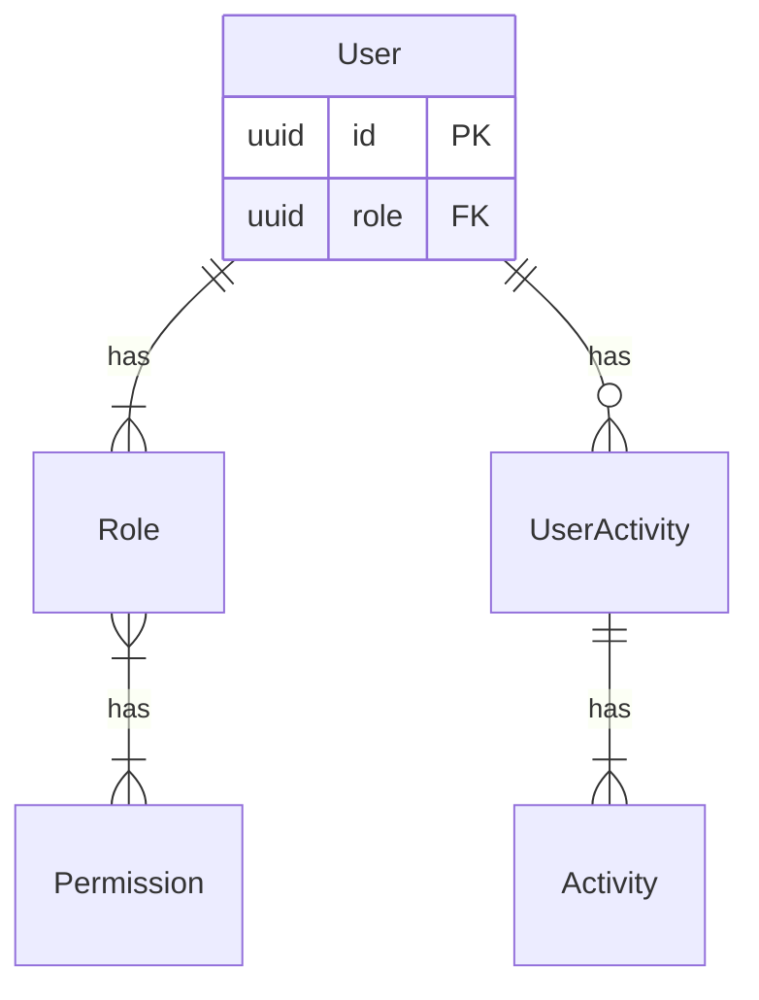
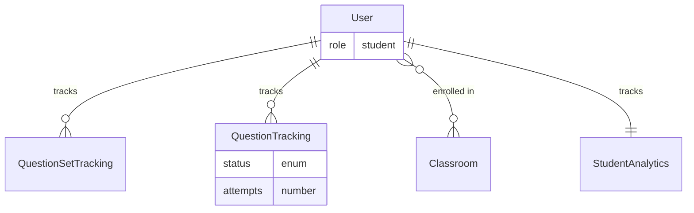
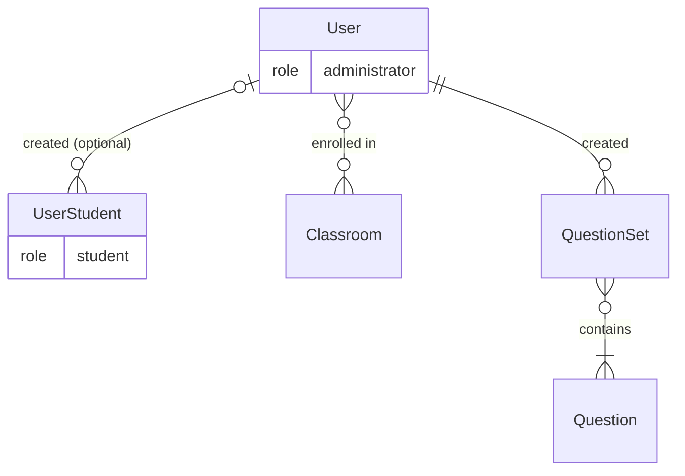
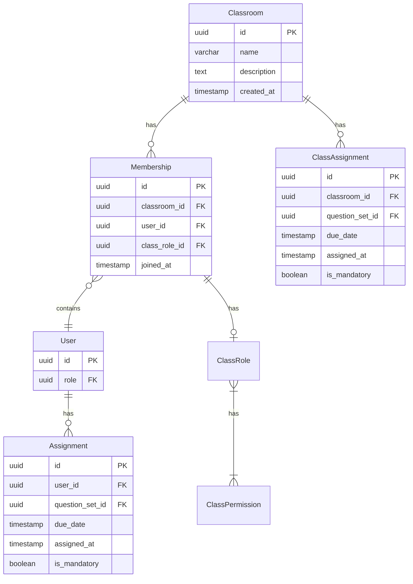
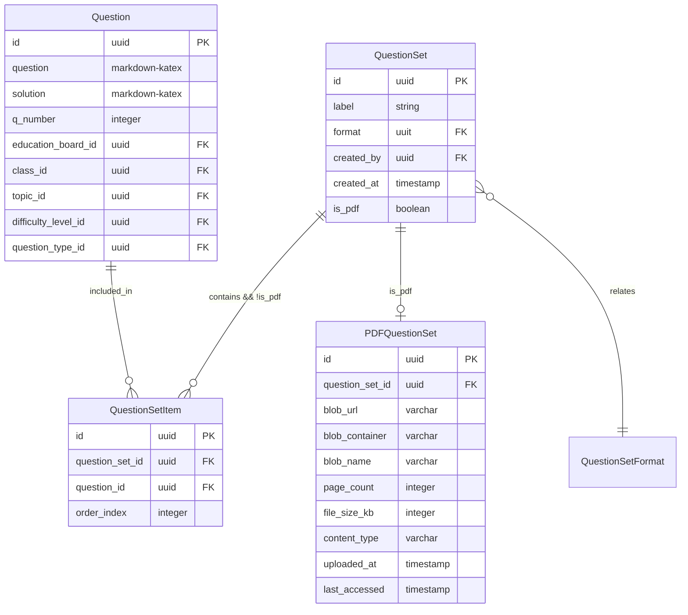

# Data Layer Design

## Overview
This document outlines the data layer architecture for the learning platform using PostgreSQL as the primary database. The design focuses on a simplified user model with two primary roles: Students and Administrators, organized around classroom-based learning environments.

If you are unfamiliar with crow notation please see: https://cs.kenyon.edu/index.php/scmp-348-00-software-and-system-design-spring-2025/crows-foot-er-notation-using-mermaid/

## User Management

### User Roles
The core user role system provides a flexible permission structure where users can have multiple roles, each with specific permissions. The system also tracks user activities for analytics.

**Students:** represent the primary learners in the system. This diagram shows how students interact with questions, question sets, and classrooms while the system tracks their progress.

**Administrators:** have expanded capabilities including classroom management, content creation, and optionally user management. This diagram illustrates these relationships.

**Administrators derivates** Custom roles with different permissions can be created. Students are an unique role.

## Classroom
Classrooms allow teachers to manage and track their students. They can create class-wide assignments and/or student specific ones.

## Question Management

### Questions
The question management system allows for flexible organization of educational content. Questions can be grouped into sets for assignments or practice materials.

### PDF Question Sets

Some question sets are provided as PDFs rather than individual questions. These PDFs are stored in Azure Blob Storage and linked to question sets in the database.

**Key Features:**
- PDFs are stored in Azure Blob Storage for scalable access
- Metadata like page count and file size are stored in the database
- The system tracks when PDFs were last accessed
- Question sets can be either PDF-based or composed of individual questions

**Typical Workflow:**
1. Administrator uploads a PDF containing questions
2. System stores the PDF in Azure Blob Storage
3. System creates a QuestionSet record with `is_pdf = true`
4. System creates a PDFQuestionSet record with metadata and blob references
5. Students can access the PDF directly through the platform

## User Journey

### Student Self-Service Onboarding
The platform implements a completely self-service approach for student registration:

1. **Registration**: Students can register directly through the platform by:
   - Providing basic profile information (name, email, phone number, etc.)
   - Creating a secure password
   - Selecting their education board and class level

2. **Email Verification**: Students receive an email verification link to confirm their identity

3. **Immediate Access**: Upon verification, students gain immediate access to:
   - Free educational content
   - Practice questions relevant to their selected education board
   - Ability to track their learning progress

4. **Classroom Joining**: Students can join classrooms by:
   - Accepting invitations from administrators/teachers
   - Using classroom join codes provided by administrators
   - Being added directly by classroom administrators

### Administrator Onboarding with Verification
For administrators, the platform implements additional verification:

1. **Registration Options**:
   - **Institutional Verification**: Administrators from recognized educational institutions can register using their institutional email and provide credentials that will be verified
   - **Manual Approval**: School administrators can request accounts that are manually approved by platform administrators. This can also mean bulk import via CSV files.
   - **Verified Credentials**: Integration with third-party verification services to validate teaching credentials or school affiliation

2. **Role Assignment**:
   - Initial basic administrator access granted upon verification
   - Additional permissions can be assigned based on specific roles (department head, principal, etc.)

3. **Training and Onboarding**:
   - Guided walkthrough of administrator features
   - Access to administrator documentation
   - Optional training sessions for advanced features

### Classroom Creation and Management

1. **Classroom Setup**:
   - Verified administrators can create new virtual classrooms
   - Set classroom parameters (name, description, education level, etc.)
   - Generate join codes for student self-enrollment

2. **Student Management**:
   - Generate invitations
   - Monitor student activity and progress
   - Manage secondary administrator roles

3. **Content Assignment**:
   - Create and assign question sets to entire classrooms or individual students
   - Schedule assignments with due dates